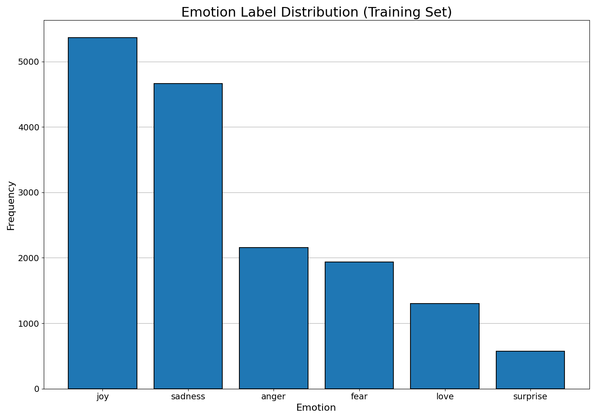

<p align="center">
  
</p>

<div align="center">

[](https://huggingface.co/meta-llama/Meta-Llama-3-8B-Instruct)
[](https://github.com/hiyouga/LLaMA-Factory)

[](LICENSE)

</div>

## Table of Contents

- [Introduction](#introduction)
- [Background](#background)
- [Key Features](#key-features)
- [Methods](#methods)
- [Experimentation](#experimentation)
- [Setup](#setup)
- [Usage](#usage)
- [Dataset](#dataset)
- [Conclusion](#conclusion)
- [Repository Notes](#repository-notes)
- [License](#license)
- [Contact](#contact)
## Introduction

This project explores emotion text classification using the Llama3-8b model, enhanced with LoRA and FlashAttention techniques. The model is optimized for identifying six emotion categories: joy, sadness, anger, fear, love, and surprise. The Llama3-8b model demonstrates superior performance with an accuracy of 0.9262, surpassing other transformer models such as BERT-Base, BERT-Large, RoBERTa-Base, and RoBERTa-Large.

Concretely, this repository is the [LLaMA-Factory](https://github.com/hiyouga/LLaMA-Factory) YAML configs, dataset, and evaluation script needed to reproduce that result end to end — training and inference are driven entirely through `llamafactory-cli`, with no custom training loop implemented here (see [Setup](#setup) and [Repository Notes](#repository-notes)).

## Background

Natural Language Processing (NLP) has become a key focus area for sentiment analysis, also known as sentiment classification or sentiment detection. This technology helps businesses understand consumer emotions and opinions, enhancing customer satisfaction and product development. The vast amount of data in large companies makes manual analysis impractical, leading to the adoption of AI and NLP algorithms. This project targets a more fine-grained version of that problem — six-class emotion classification (joy, sadness, anger, fear, love, surprise) rather than coarse positive/negative/neutral sentiment — using an instruction-tuned LLM instead of a traditional sentiment-analysis pipeline.

## Key Features

- **Model**: `meta-llama/Meta-Llama-3-8B-Instruct`, fine-tuned via supervised LoRA fine-tuning (SFT).
- **Techniques**: LoRA for efficient parameter tuning, FlashAttention-2 for optimized attention computation.
- **Dataset**: Six-class emotion text dataset (16,000 train / 2,000 test records).
- **Performance**: 92.62% accuracy, surpassing BERT and RoBERTa baselines (Table 3).

## Methods

<div align="center">
    
    <br>
    <b>Figure 1: Architecture of Llama3-8b</b>
</div>

### Llama3-8b Model

The Llama3-8b model, developed by Meta AI, is a large language model optimized for dialogue use cases. It contains 8 billion parameters and features significant improvements over previous models. The Llama3 series incorporates a multi-phase training process that includes pretraining, supervised fine-tuning, and iterative refinement using reinforcement learning with human feedback (RLHF). This process ensures that the model aligns closely with human preferences for helpfulness and safety.

The architectural advancements in Llama3 include the implementation of Grouped-Query Attention (GQA). GQA clusters queries to share key-value pairs, thus reducing memory and computational costs while maintaining high performance. This method significantly enhances the efficiency of attention calculations, particularly in large-scale models.

Llama3-8b is pretrained on a diverse dataset comprising more than 15 trillion tokens from publicly available data, with the model's knowledge cutoff set at March 2023. The fine-tuning phase utilized publicly available instruction datasets and over 10 million human-annotated examples, ensuring a robust understanding of various language tasks.

<div align="center">
    <table>
        <caption><b>Table 1: Llama3-8b Model Details</b></caption>
        <tr>
            <th>Feature</th>
            <th>Specification</th>
        </tr>
        <tr>
            <td>Training Data</td>
            <td>Publicly available data</td>
        </tr>
        <tr>
            <td>Parameters</td>
            <td>8B</td>
        </tr>
        <tr>
            <td>Context Length</td>
            <td>8k</td>
        </tr>
        <tr>
            <td>GQA</td>
            <td>Yes</td>
        </tr>
        <tr>
            <td>Token Count</td>
            <td>15T+</td>
        </tr>
        <tr>
            <td>Knowledge Cutoff</td>
            <td>March 2023</td>
        </tr>
    </table>
</div>

### Instruction Fine-Tuning

Instruction fine-tuning enhances the model's zero-shot learning capabilities across diverse tasks. This technique involves training the model on datasets specifically designed to improve its ability to follow instructions. For example, models trained on datasets like Alpaca-7B can exhibit behaviors similar to OpenAI's text-davinci-003 in understanding and executing instructions.

### LoRA Method for Training

LoRA (Low-Rank Adaptation) is a technique used to integrate trainable rank decomposition matrices into each layer of the Transformer architecture. This method significantly reduces the number of trainable parameters while adapting large language models to specific tasks or domains. Unlike full fine-tuning, LoRA keeps the pretrained model weights unchanged, updating only the low-rank matrices during the adaptation process. This approach enhances training efficiency, reduces storage needs, and does not increase inference latency compared to fully fine-tuned models.

<div align="center">
    
    <br>
    <b>Figure 2: LoRA Training Method</b>
</div>

### Flash Attention V2

FlashAttention V2 is an optimization technique designed to accelerate the attention mechanism in Transformer models. It is an *exact* algorithm — it computes the same attention output as standard attention, not an approximation — but is IO-aware: it tiles the Q/K/V matrices into blocks that fit in fast on-chip SRAM and computes softmax incrementally ("online softmax"), so the full N×N attention matrix is never materialized in slower GPU HBM. This sharply cuts the number of HBM reads/writes, which is the actual bottleneck for attention on modern GPUs, reducing both memory usage and wall-clock time versus standard attention without changing the result.

## Experimentation

<div align="center">
    
    <br>
    <b>Figure 3: Emotion Text Label Distribution</b>
</div>

### Data Analysis

The dataset used for training the model consists of text labeled with six emotions: joy, sadness, anger, fear, love, and surprise. The distribution is imbalanced: "joy" and "sadness" together make up roughly 63% of the training set, while "love" and "surprise" combined make up under 12% (Figure 3). Overall accuracy alone can be a misleading metric under this kind of skew, which is why `scripts/evaluate.py` reports per-class accuracy in addition to the overall number (see [Evaluation Metrics](#evaluation-metrics)).

### Experiment Settings

The Llama3-8b model's hyperparameters are set as follows:

<div align="center">
    <table>
        <caption><b>Table 2: Experiment Settings for Llama3-8b</b></caption>
        <tr>
            <th>Parameter</th>
            <th>Setting</th>
        </tr>
        <tr>
            <td>Optimizer</td>
            <td>AdamW</td>
        </tr>
        <tr>
            <td>Learning Rate</td>
            <td>5e-5</td>
        </tr>
        <tr>
            <td>LR Scheduler</td>
            <td>Cosine, 10% warmup</td>
        </tr>
        <tr>
            <td>Batch Size</td>
            <td>5</td>
        </tr>
        <tr>
            <td>Epochs</td>
            <td>3</td>
        </tr>
        <tr>
            <td>LoRA Rank</td>
            <td>8</td>
        </tr>
        <tr>
            <td>Gradient Accumulation Steps</td>
            <td>4</td>
        </tr>
        <tr>
            <td>Max Length</td>
            <td>512</td>
        </tr>
    </table>
</div>

The model is trained using the AdamW optimizer (LLaMA-Factory's default, decoupling weight decay from the adaptive learning-rate update). A cosine learning rate schedule with a 10% linear warmup is employed to adjust the learning rate during training. The batch size is set to 5, with gradient accumulation over 4 steps to optimize memory usage. The model is trained for 3 epochs, with the FP16 precision format used to save GPU memory while maintaining performance. The LoRA rank of 8 indicates the order of the low-rank matrix used in the adaptation process.

### Evaluation Metrics

The primary metric used to evaluate the model's performance is accuracy. This metric measures the proportion of correct predictions made by the model out of all predictions. Since this is a six-class problem rather than binary, accuracy is computed directly over all classes:

$$
\text{Accuracy} = \frac{\text{Number of Correct Predictions}}{\text{Total Number of Predictions}}
$$

`scripts/evaluate.py` also reports this per class (see [Usage](#usage)), since an overall average can mask weak performance on minority classes like "surprise," which has roughly 9x fewer training examples than "joy" (Figure 3).

### Experiment Analysis

The model's performance is compared against other popular NLP models, such as BERT-Base, BERT-Large, RoBERTa-Base, and RoBERTa-Large. The Llama3-8b model achieves the highest accuracy of 0.9262, demonstrating the effectiveness of instruction fine-tuning and the model's large parameter set. The superior performance of Llama3-8b in this task underscores the advantages of large language models in achieving high accuracy across diverse and challenging text classification tasks.

<div align="center">
    <table>
        <caption><b>Table 3: Accuracy Results for Different Models</b></caption>
        <tr>
            <th>Model</th>
            <th>Accuracy</th>
        </tr>
        <tr>
            <td>BERT-Base</td>
            <td>0.9063</td>
        </tr>
        <tr>
            <td>BERT-Large</td>
            <td>0.9086</td>
        </tr>
        <tr>
            <td>RoBERTa-Base</td>
            <td>0.9125</td>
        </tr>
        <tr>
            <td>RoBERTa-Large</td>
            <td>0.9189</td>
        </tr>
        <tr>
            <td>Llama3-8b</td>
            <td>0.9262</td>
        </tr>
    </table>
</div>

## Setup

This project uses [LLaMA-Factory](https://github.com/hiyouga/LLaMA-Factory) as a pip dependency — no framework code is vendored here:

```bash
git clone https://github.com/DaoyuanLi2816/llama3-emotion-lora.git
cd llama3-emotion-lora
pip install -r requirements.txt   # llamafactory + nltk/jieba/rouge-chinese for metrics; bitsandbytes for 16 GB GPUs
huggingface-cli login             # the Llama3 weights are gated
```

`flash_attn: fa2` in the training config asks LLaMA-Factory for FlashAttention-2, but the `flash-attn` package itself is not pinned in `requirements.txt` (it needs a matching CUDA/torch build and is slow to compile from source). Without it installed, LLaMA-Factory logs a warning and falls back to PyTorch's SDPA attention automatically — training still runs correctly, just without the FlashAttention-2 kernel. Install it separately with `pip install flash-attn --no-build-isolation` to match the reported setup exactly.
## Usage

Fine-tune Llama3-8b with LoRA on the emotion dataset (hyperparameters exactly as reported in Table 2 — AdamW lr 5e-5, cosine schedule with 10% warmup, batch 5 × grad-accum 4, 3 epochs, LoRA rank 8, max length 512, fp16, FlashAttention-2):

```bash
llamafactory-cli train config/emotion_llama3_lora.yaml
```

Generate predictions for the 2,000-sample test split with the trained adapter, then score them:

```bash
llamafactory-cli train config/emotion_llama3_predict.yaml
python scripts/evaluate.py saves/llama3-8b-emotion-lora/predict/generated_predictions.jsonl
```

The fp16 run fits a 24 GB GPU; on 16 GB cards add `quantization_bit: 4` (QLoRA) to the training config.
## Dataset

The model is trained and evaluated on a six-class emotion dataset:

- `data/emotion_train.json` - training split.
- `data/emotion_test.json` - test split.

Each record is an instruction-style example asking the model to classify a piece of text into one of six emotions: **joy, sadness, anger, fear, love, surprise**. The label distribution is imbalanced — "joy" is the most frequent class and "surprise" the least (roughly 9x fewer examples); see [Data Analysis](#data-analysis) and Figure 3.
## Conclusion

This project demonstrates the potential of large language models, such as Llama3-8b, in domain-specific tasks like emotion text classification. The model's performance, boosted by specialized techniques like LoRA and FlashAttention, underscores the effectiveness of large models in achieving high accuracy in NLP applications.

## Repository Notes

This project builds on [LLaMA-Factory](https://github.com/hiyouga/LLaMA-Factory) **as a pip dependency** — the framework is not vendored into this repository. Everything tracked here is project-specific:

- `data/emotion_train.json` / `data/emotion_test.json` — the six-class emotion dataset (16,000 / 2,000 instruction-style records), registered via `data/dataset_info.json`.
- `config/emotion_llama3_lora.yaml` / `config/emotion_llama3_predict.yaml` — the training and prediction configs reproducing the reported run.
- `scripts/evaluate.py` — overall and per-class accuracy from the generated predictions.
- This `README.md` and the figures.
## License

This project is licensed under the Apache License 2.0 - see the [LICENSE](LICENSE) file for details.

This project is based on modifications to the original work available under [LLaMA-Factory](https://github.com/hiyouga/LLaMA-Factory), which is licensed under the Apache License 2.0.

## Contact

For any questions or issues, please contact Daoyuan Li at lidaoyuan2816@gmail.com.
